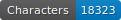
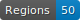
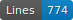
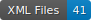

Memorials for Jane Lathrop Stanford
===================================

    

Ce projet a été réalisé par l'équipe composée de Ingrid GUIMARÃES, Yagmur OZTURK et Perrine MAUREL.
Ce projet a été réalisé dans le cadre du Module "Fondamentaux de l’informatique" assuré par Thibault CLÉRICE pour le Master 1 HN PSL à l'Ecole Nationale des Chartes.

## Structure du dépôt

Le dépôt est composé de quatre dossiers, d'un rapport en .odt et d'un fichier README.md, la présente. Toutes les images sont au fichier .jpg, toutes les retranscriptions sont au format .xml ALTO.

Le dossier nommé "Issues_Solved_hors_GitHUB" contient trois fichiers .odt répertoriant les issues précédemment rencontrées et résolues sans avoir été consignées sur GitHUB.

Les données se trouvent au chemin UNIX `./data/**/**/*.xml`.

Chaque dossier sous `./data` contient la contribution d'une autrice. Les dossiers `Page` représentent en gros 600 caractères, sauf pour `PageX`.

Les lettres sélectionnées étaient:
- [les lettres: 42, 43, 46, 49, 50, 54, 57 à 60, 69, 75, 76](data/by_pierrine_maurel), retranscrites par Perrine MAUREL;
- [80 à 93](data/by_ingrid_guimaraes), retranscrites par Ingrid GUIMARÃES;
- [241 à 252](data/by_yagmur_ozturk), retranscrites par Yagmur OZTURK.

## Sources

Les images utilisées pour la retrancription peuvent être retrouvées ici : https://fromthepage.com/stanforduniversityarchives/jls/memorials-1905

Afin de télécharger des images de meilleure qualité, nous avons utilisé https://github.com/PonteIneptique/dl-ftpage#dl-ftpage script créé par Thibault CLÉRICE.

## Transcription

Notre retranscription en elle-même a cherché à retranscrire le texte *ipsis litteris*, sans le corriger, en conservant donc les erreurs éventuelles intrinsèques au document. Il convient toutefois de noter que dans certains cas, les documents présentaient des mentions imprécises qui n’avaient pas été prises en compte par les retranscriptions originelles, ou alors qui avaient été soulignées comme étant une retranscription incertaine. Nous avons alors fait le choix d’être plus exhaustif que la retranscription originelle si possible, et nous avons parfois fait des choix de retranscription différents sur la base de notre ressenti visuel lors du travail. En raison de ces choix, la taille d’une page s’est donc parfois avérée rallongée par rapport à l’estimation première.